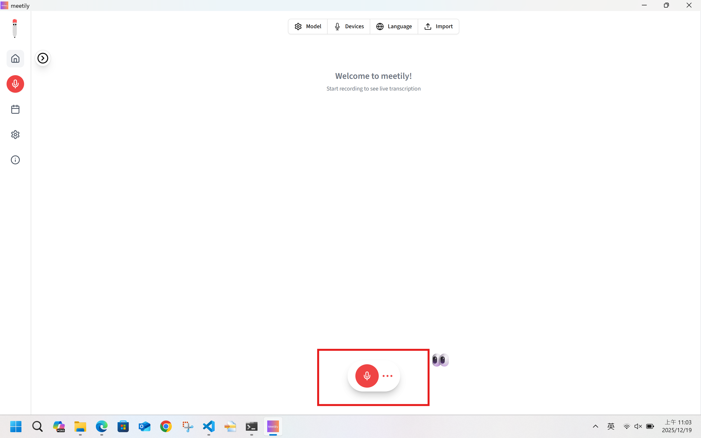
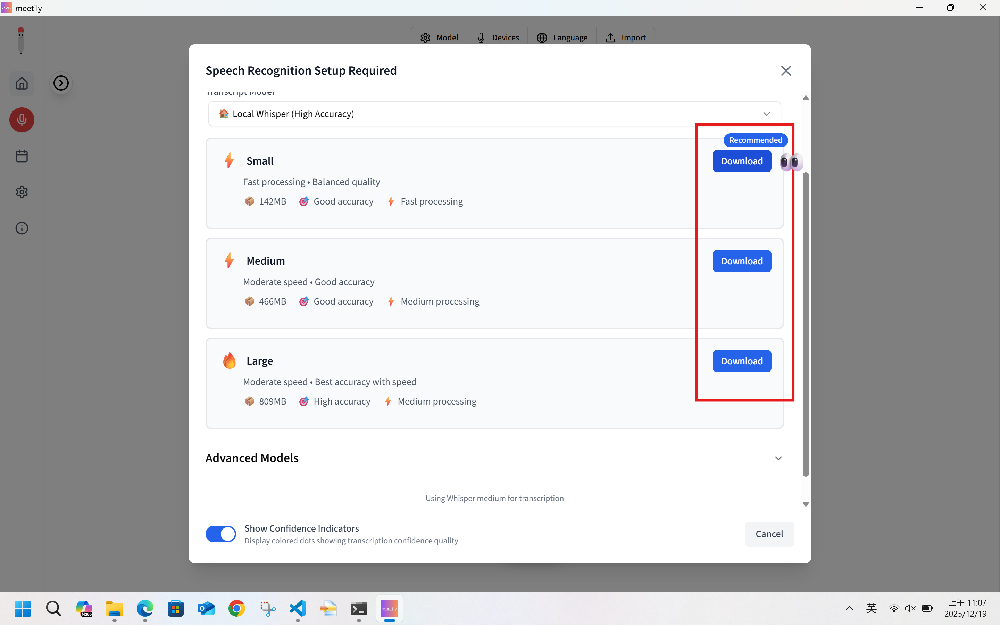
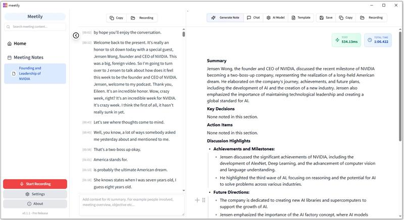
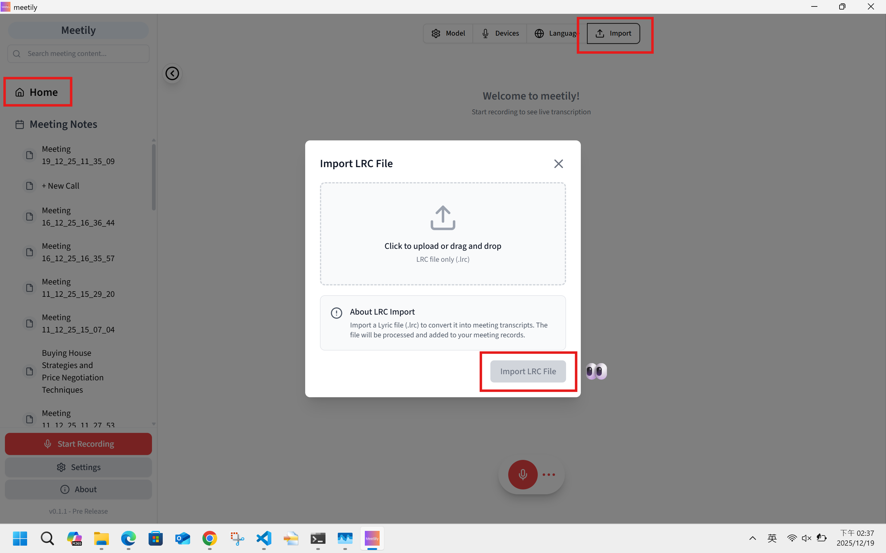

# aiDAPTIV Integration User Guide

## Overview

Welcome to the aiDAPTIV Integration User Guide for Meeting Minutes! This comprehensive guide will walk you through the installation, setup, and usage of the aiDAPTIV integration with the Meeting Minutes application.

aiDAPTIV integration leverages the innovative **aiDAPTIV+ kvcache** technology to enhance Meeting Minutes with lightning-fast AI-powered capabilities. By building a knowledge cache of your project, it enables near-instantaneous responses and significantly enhances your meeting transcription and summarization experience.

This guide covers:

- Installation and setup procedures
- How to use the integration with demo examples

Let's get started!

---

## Chapter 1: Installation and Setup

### 1.1 Download Installation Files

Pre-built `.exe` installation files are available on the [GitHub Releases](https://github.com/Zackriya-Solutions/meeting-minutes/releases) page. Each release typically includes multiple build variants to support different hardware configurations:

- **CUDA version**: Optimized for NVIDIA GPUs with CUDA support
- **Vulkan version**: Compatible with AMD/Intel GPUs and systems using Vulkan API

Additional build variants may be available in specific releases depending on hardware support requirements. Please check the release notes for the latest available versions.

---

## Chapter 2: How to Use?

### 2.1 Real-time Recording Mode
> 💡 How KV Cache Reuse Works in Real-time Recording Mode

**Step 1: Press the button to start record**
- 

**Step 2: Select the ASR model or ensure it is already installed**
- 

**Step 3: During transcription, each generated summary note indicates that the current transcript has already been processed through the KV cache**
- 

**Step 4: When you switch to chat mode for conversations about this transcript, the chat process will also benefit from KV cache reuse**
> For detailed examples, please refer to [section 2.3 Chatting with KV Cache Reuse](#23-chatting-with-kv-cache-reuse)

---

### 2.2 Transcript Upload Mode
> 💡 How KV Cache Reuse Works in Transcript Upload Mode

**Step 1: Import the .lrc format transcript**
- 

**Step 2: Once the transcript is successfully loaded, a summary note will be automatically generated, indicating that the transcript has already been processed through the KV cache**
> or you can manually click the "Generate Note" button at the top to generate it
- 

**Step 3: When you switch to chat mode for conversations about this transcript, the chat process will also benefit from KV cache reuse**
> For detailed examples, please refer to [section 2.3 Chatting with KV Cache Reuse](#23-chatting-with-kv-cache-reuse)

---

### 2.3 Chatting with KV Cache Reuse
- 
